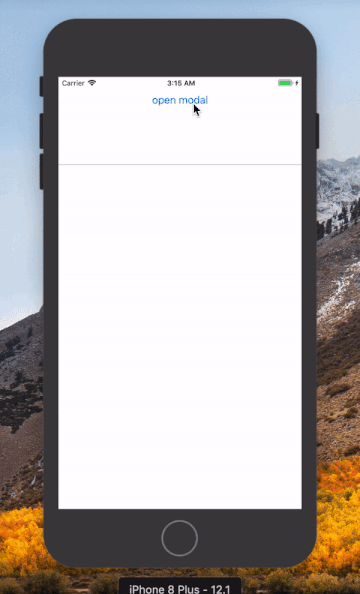

# react-native-modalizer
A fully customizable, animated modal component for React-Native. Make modals out of anything, such fun!



## Installation

*** npm package temporarily unavailable, will be re-released on 8th January 2020. Meanwhile if you want to use it, just copy index.js from ./src and make sure you prop-types dependency installed. ***
In your project root run:

```
npm install --save react-native-modalizer
```

Import the module:

```
import Modalizer from 'react-native-modalizer'
```

## Props

| Name     |   Type   |   Required   | Description  |
| :------- | :------: | :---------: | :----------- |
| modalOpen   | `bool` | yes  | Set true to open modal, set false to close |
| wrapperStyle  |  {}  |   optional   | Overwrite any default wrapper styles |
| containerStyle |  {}  |   optional    | Overwrite any default modal content container styles |

## Usage

Usage is simple, place the Modalizer inside any container (the component will take up 100% of the width and height of it), render children between the tags and use modalOpen prop to control opening and closing the modal. When you change the modalOpen prop animation is triggered and all of the content inside the modal is either rendered or unmounted.

```
<Modalizer modalOpen={modalOpen}>
  {Render children here}
</ Modalizer>
```

## Example usage

```
export default (props) => {
  const [ modalOpen, setModalOpen] = useState(false)
  
  const modalContent = (
    <View style={{ flex: 1 }}>
      <View style={{ flex: 3 }}>
        <Image 
          style={{ height: '100%', width: '100%'}}
          source={{uri: 'https://images.pexels.com/photos/3418058/pexels-photo-3418058.jpeg?auto=compress&cs=tinysrgb&dpr=2&h=750&w=1260 '}}
        />
      </ View>
      <View style={{ flex: 1, justifyContent: 'center', alignItems: 'center' }}>
        <Text>This is a modal</Text> 
      </ View>
      <View style={{ flex: 1 }}>
        <Button title="Close modal" onPress={() => setModalOpen(false)}/>
      </ View>
    </View>
	)

  return (
    <ScreenContainer style={{ flex: 1 }} >
      <Button title="open modal" onPress={() => setModalOpen(true)}/>
      <Modalizer modalOpen={modalOpen}>
        {modalContent}
      </ Modalizer>
    </ScreenContainer>
  )
}
```

## Altering default styles

The modal consists of two parts, the outter wrapper and the inner content container (the actual modal). The wrapper takes up 100% of width and height of any container where you put it to prevent scrolling the content and to center the modal. To alter the size or look of the modal, use the containerStyle prop to override any default styles.

## Other

[NPM link](https://www.npmjs.com/package/react-native-modalizer)

